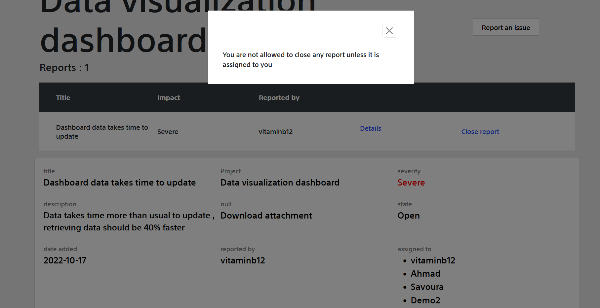

## How to run?
- cd django-bug-tracking-system
- cd bug_tracking_system
- python manage.py runserver
- open the localhost with the right port

## Demo

### sign up

### Add a project

### Search projects

### Comment on a report

### Reports page

### Assigned reports

### Closing reports

